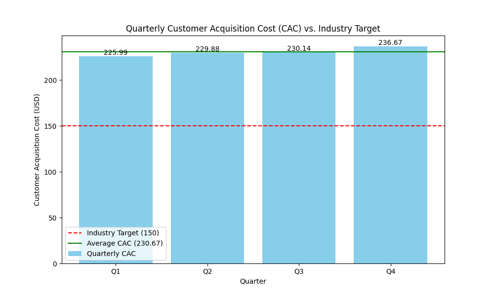

# Financial Services Performance Analysis: A Data Story

## The Challenge: Rising Customer Acquisition Costs

Our company is facing a critical challenge: our Customer Acquisition Cost (CAC) is steadily rising, moving further away from the industry benchmark. This trend threatens our profitability and market competitiveness. This analysis dives into the quarterly CAC data for 2024 to understand the problem and propose a data-driven solution.

**Contact:** 23f3000228@ds.study.iitm.ac.in

## Key Findings

The data for 2024 shows a clear and concerning upward trend in our CAC:

*   **Q1:** $225.99
*   **Q2:** $229.88
*   **Q3:** $230.14
*   **Q4:** $236.67

The average CAC for the year is **$230.67**, which is significantly higher than the industry target of **$150**.

### CAC Trend Visualization

The following chart illustrates the widening gap between our quarterly CAC and the industry benchmark:

## Business Implications

If this trend continues, we can expect the following negative impacts:

*   **Reduced Profitability:** Higher CAC directly eats into our profit margins, making each new customer less profitable.
*   **Decreased Marketing ROI:** Our marketing efforts are becoming less efficient, yielding a lower return on investment.
*   **Loss of Competitive Advantage:** Competitors with lower CAC can afford to be more aggressive with their pricing and marketing, potentially capturing a larger market share.

## Recommendations: Optimize Digital Marketing Channels

The key to reversing this trend lies in a strategic overhaul of our customer acquisition strategy. The primary recommendation is to **optimize digital marketing channels**. This can be achieved through the following specific actions:

1.  **A/B Testing Ad Copy and Creatives:** Continuously test different versions of ads to identify the most effective messaging and visuals for our target audience.
2.  **Refine Audience Targeting:** Leverage customer data to create more granular audience segments and tailor marketing campaigns to their specific needs and behaviors.
3.  **Invest in SEO:** Improve organic search rankings to attract high-intent customers at a lower cost per acquisition.
4.  **Content Marketing:** Develop valuable content (blog posts, whitepapers, webinars) to attract and nurture potential customers, building brand authority and reducing reliance on paid advertising.
5.  **Conversion Rate Optimization (CRO):** Analyze and optimize our website and landing pages to improve the user experience and increase the percentage of visitors who convert into customers.

By implementing these recommendations, we can begin to drive down our CAC and work towards the industry target of $150, ensuring the long-term financial health and growth of our company.
